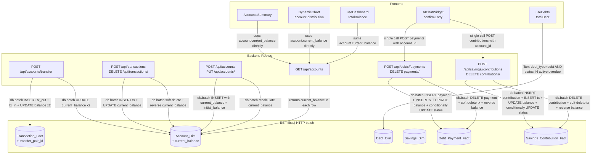

# Design Document — finance-logic-refactor

## Overview

This refactor closes six known correctness gaps in Finance Management by Voicer's core finance logic:

1. **Transfer Pair Constraint** — transfer transactions are created and deleted atomically as linked pairs.
2. **Atomic Debt Payment** — recording a payment always updates both `Debt_Payment_Fact` and `Debt_Dim.outstanding_balance` in a single atomic operation.
3. **Atomic Savings Contribution** — recording a contribution always updates both `Savings_Contribution_Fact` and `Savings_Dim.current_balance` atomically.
4. **Server-Side Account `current_balance`** — account balances are stored and maintained server-side, eliminating expensive client-side recomputation from the full transaction history.
5. **Unified `totalDebt` filter** — `useDebts` and `DynamicChart` use an identical filter (`debt_type='debt' AND status IN ('active','overdue')`) so the two displayed numbers can never diverge.
6. **Migration Safety** — all schema changes are backward-compatible `ALTER TABLE ADD COLUMN` migrations, tracked in `schema_migrations` and executed idempotently at startup.

### Critical Constraint

`libsql_client` in HTTP mode **does not support** multi-statement transactions via `BEGIN`/`COMMIT`. The only mechanism for atomic multi-statement execution is `db.batch([stmt1, stmt2, ...])`. Every place in this spec that requires atomicity uses `db.batch()`.

---

## Architecture

### High-Level Data Flow (After Refactor)



### Batch Execution Pattern

All multi-statement operations use the following pattern:

```python
import libsql_client

db.batch([
    libsql_client.Statement("SQL statement 1", [param1, param2]),
    libsql_client.Statement("SQL statement 2", [param1]),
    # ...
])
```

If any statement in the batch fails, the entire batch is rolled back by the libsql HTTP protocol. No partial state is ever persisted.

---

## Components and Interfaces

### Backend Components

#### `backend/database.py` — New Migration Functions

Two new migration functions are added and called from `initialize_db()`:

```python
def _add_transfer_pair_id_column(db) -> None:
    """Add transfer_pair_id TEXT nullable to Transaction_Fact. Idempotent."""
    migration_name = "add_transfer_pair_id_column"
    if _migration_applied(db, migration_name):
        return
    try:
        db.execute("ALTER TABLE Transaction_Fact ADD COLUMN transfer_pair_id TEXT")
        logger.info("Migrated Transaction_Fact: added transfer_pair_id")
    except Exception:
        pass  # column already exists
    _mark_migration_done(db, migration_name)


def _add_account_current_balance(db) -> None:
    """Add current_balance INTEGER NOT NULL DEFAULT 0 to Account_Dim,
    then immediately recompute from Transaction_Fact. Idempotent."""
    migration_name = "add_account_current_balance"
    if _migration_applied(db, migration_name):
        return
    try:
        db.execute(
            "ALTER TABLE Account_Dim ADD COLUMN current_balance INTEGER NOT NULL DEFAULT 0"
        )
        logger.info("Migrated Account_Dim: added current_balance")
    except Exception:
        pass  # column already exists

    # Recompute from existing transactions
    db.execute("""
        UPDATE Account_Dim
        SET current_balance = initial_balance + COALESCE((
            SELECT SUM(CASE
                WHEN type IN ('income', 'transfer_in') THEN amount
                WHEN type IN ('expense', 'transfer_out') THEN -amount
                ELSE 0
            END)
            FROM Transaction_Fact
            WHERE Transaction_Fact.account_id = Account_Dim.account_id
              AND Transaction_Fact.is_deleted = 0
        ), 0)
    """)
    logger.info("Recomputed current_balance for all accounts from Transaction_Fact")
    _mark_migration_done(db, migration_name)
```

Both functions are added to `initialize_db()` after the existing migration calls:

```python
def initialize_db() -> None:
    # ... existing calls ...
    _add_transfer_pair_id_column(db)
    _add_account_current_balance(db)
```

#### `backend/routes/accounts.py` — New and Updated Endpoints

**New endpoint: `POST /api/accounts/transfer`**

```python
@accounts_bp.route("/api/accounts/transfer", methods=["POST"])
@require_auth
def transfer_between_accounts():
    """
    Create a transfer pair atomically via db.batch().
    Body: { from_account_id, to_account_id, amount, date, note? }
    Returns: { message, transfer_pair_id, out_transaction_id, in_transaction_id }
    """
```

Request body:

| Field | Type | Required | Notes |
|---|---|---|---|
| `from_account_id` | integer | yes | Source account |
| `to_account_id` | integer | yes | Destination account |
| `amount` | integer | yes | Positive VND amount |
| `date` | string | yes | `YYYY-MM-DD HH:MM:SS` |
| `note` | string | no | Optional memo |

Logic:
1. Validate both accounts belong to `g.user_id`.
2. Generate `transfer_pair_id = f"pair-{int(time.time() * 1000)}"`.
3. Generate two transaction IDs: `tx-{ts}` and `tx-{ts+1}`.
4. Build a `db.batch()` with 4 statements:
   - INSERT `transfer_out` into Transaction_Fact (from_account)
   - INSERT `transfer_in` into Transaction_Fact (to_account)
   - UPDATE `Account_Dim.current_balance -= amount WHERE account_id = from_account_id`
   - UPDATE `Account_Dim.current_balance += amount WHERE account_id = to_account_id`

**Updated: `create_account()`**

Add `current_balance = initial_balance` to the INSERT statement:

```python
db.execute(
    "INSERT INTO Account_Dim (user_id, account_name, account_type, initial_balance, current_balance, color) VALUES (?, ?, ?, ?, ?, ?)",
    [g.user_id, account_name, account_type, initial_balance, initial_balance, color],
)
```

**Updated: `update_account()`**

When `initial_balance` is in the update payload, use `db.batch()` to recalculate `current_balance`:

```python
if "initial_balance" in updates:
    # Recalculate current_balance = new_initial_balance + Σ transactions
    new_initial = updates["initial_balance"]
    stmts = [
        libsql_client.Statement(
            f"UPDATE Account_Dim SET {set_clause} WHERE account_id = ? AND user_id = ?",
            list(updates.values()) + [account_id, g.user_id],
        ),
        libsql_client.Statement("""
            UPDATE Account_Dim
            SET current_balance = ? + COALESCE((
                SELECT SUM(CASE
                    WHEN type IN ('income', 'transfer_in') THEN amount
                    WHEN type IN ('expense', 'transfer_out') THEN -amount
                    ELSE 0 END)
                FROM Transaction_Fact
                WHERE account_id = ? AND is_deleted = 0
            ), 0)
            WHERE account_id = ? AND user_id = ?
        """, [new_initial, account_id, account_id, g.user_id]),
    ]
    db.batch(stmts)
else:
    db.execute(
        f"UPDATE Account_Dim SET {set_clause} WHERE account_id = ? AND user_id = ?",
        list(updates.values()) + [account_id, g.user_id],
    )
```

#### `backend/routes/transactions.py` — Updated Endpoints

**Updated: `create_transaction()`**

After inserting the transaction, update `current_balance` in the same batch:

```python
delta = int(amount) if tx_type in ('income', 'transfer_in') else -int(amount)

db.batch([
    libsql_client.Statement(
        "INSERT INTO Transaction_Fact (transaction_id, transaction_date, account_id, category_id, amount, type, note, user_id, payee_id, location) VALUES (?, ?, ?, ?, ?, ?, ?, ?, ?, ?)",
        [transaction_id, transaction_date, account_id, category_id, int(amount), tx_type, note, g.user_id, payee_id, location],
    ),
    libsql_client.Statement(
        "UPDATE Account_Dim SET current_balance = current_balance + ? WHERE account_id = ? AND user_id = ?",
        [delta, account_id, g.user_id],
    ),
])
# Split rows inserted separately (not batched with main tx — splits don't affect balance)
if splits:
    for s in splits:
        db.execute(...)
```

> Note: Split rows are inserted individually after the batch. Splits do not change `current_balance` directly (the parent transaction's amount already accounts for them).

**Updated: `delete_transaction()`**

Fetch the transaction type and amount first, then batch the soft-delete + balance reversal. Also handle transfer pair deletion:

```python
# Fetch transaction data
tx_row = db.execute(
    "SELECT type, amount, transfer_pair_id FROM Transaction_Fact WHERE transaction_id = ? AND user_id = ? AND is_deleted = 0",
    [transaction_id, g.user_id],
)
tx_data = tx_row.rows[0]
tx_type, amount, transfer_pair_id = tx_data[0], tx_data[1], tx_data[2]
delta = amount if tx_type in ('income', 'transfer_in') else -amount  # amount to reverse

if transfer_pair_id:
    # Fetch the paired transaction
    pair_row = db.execute(
        "SELECT transaction_id, type, amount, account_id FROM Transaction_Fact WHERE transfer_pair_id = ? AND transaction_id != ? AND is_deleted = 0",
        [transfer_pair_id, transaction_id],
    )
    if pair_row.rows:
        pair_id, pair_type, pair_amount, pair_account_id = pair_row.rows[0]
        pair_delta = pair_amount if pair_type in ('income', 'transfer_in') else -pair_amount
        db.batch([
            libsql_client.Statement("DELETE FROM split_transactions WHERE transaction_id = ?", [transaction_id]),
            libsql_client.Statement("UPDATE Transaction_Fact SET is_deleted = 1 WHERE transaction_id = ? AND user_id = ?", [transaction_id, g.user_id]),
            libsql_client.Statement("UPDATE Account_Dim SET current_balance = current_balance - ? WHERE account_id = ? AND user_id = ?", [delta, account_id, g.user_id]),
            libsql_client.Statement("UPDATE Transaction_Fact SET is_deleted = 1 WHERE transaction_id = ?", [pair_id]),
            libsql_client.Statement("UPDATE Account_Dim SET current_balance = current_balance - ? WHERE account_id = ? AND user_id = ?", [pair_delta, pair_account_id, g.user_id]),
        ])
    else:
        # Pair already deleted — just delete this one
        _delete_single_transaction(db, transaction_id, account_id, delta, g.user_id)
else:
    # Legacy transfer or non-transfer: delete only this row
    _delete_single_transaction(db, transaction_id, account_id, delta, g.user_id)
```

Helper:

```python
def _delete_single_transaction(db, transaction_id, account_id, delta, user_id):
    db.batch([
        libsql_client.Statement("DELETE FROM split_transactions WHERE transaction_id = ?", [transaction_id]),
        libsql_client.Statement("UPDATE Transaction_Fact SET is_deleted = 1 WHERE transaction_id = ? AND user_id = ?", [transaction_id, user_id]),
        libsql_client.Statement("UPDATE Account_Dim SET current_balance = current_balance - ? WHERE account_id = ? AND user_id = ?", [delta, account_id, user_id]),
    ])
```

#### `backend/routes/debts.py` — Updated Endpoints

**Updated: `create_debt_payment()`**

Accept the new `account_id` and `note` fields. Build batch based on whether `account_id` is provided:

```python
@debts_bp.route("/api/debts/<int:debt_id>/payments", methods=["POST"])
@require_auth
def create_debt_payment(debt_id: int):
    """
    Body: { amount_paid, payment_date, account_id? (int), note? }
    When account_id provided: atomically creates linked transaction + updates balance.
    When account_id absent: only creates payment record + updates balance.
    """
```

When `account_id` is provided (batch of 3–4 statements):

```python
transfer_type = 'transfer_out' if debt.debt_type == 'debt' else 'transfer_in'
transaction_id = f"tx-{int(time.time() * 1000)}"
delta = -amount_paid if transfer_type == 'transfer_out' else amount_paid

stmts = [
    libsql_client.Statement(
        "INSERT INTO Transaction_Fact (transaction_id, transaction_date, account_id, category_id, amount, type, note, user_id) VALUES (?, ?, ?, ?, ?, ?, ?, ?)",
        [transaction_id, payment_date, account_id, transfer_category_id, amount_paid, transfer_type, note or '', g.user_id],
    ),
    libsql_client.Statement(
        "INSERT INTO Debt_Payment_Fact (debt_id, transaction_id, payment_date, amount_paid, principal_portion, interest_portion) VALUES (?, ?, ?, ?, ?, ?)",
        [debt_id, transaction_id, payment_date, amount_paid, amount_paid, 0],
    ),
    libsql_client.Statement(
        "UPDATE Debt_Dim SET outstanding_balance = outstanding_balance - ? WHERE debt_id = ?",
        [amount_paid, debt_id],
    ),
    libsql_client.Statement(
        "UPDATE Account_Dim SET current_balance = current_balance + ? WHERE account_id = ? AND user_id = ?",
        [delta, account_id, g.user_id],
    ),
    libsql_client.Statement(
        "UPDATE Debt_Dim SET status = 'settled' WHERE debt_id = ? AND outstanding_balance <= 0 AND status != 'settled'",
        [debt_id],
    ),
]
db.batch(stmts)
```

When `account_id` is absent (batch of 2 statements):

```python
stmts = [
    libsql_client.Statement(
        "INSERT INTO Debt_Payment_Fact (debt_id, transaction_id, payment_date, amount_paid, principal_portion, interest_portion) VALUES (?, ?, ?, ?, ?, ?)",
        [debt_id, None, payment_date, amount_paid, amount_paid, 0],
    ),
    libsql_client.Statement(
        "UPDATE Debt_Dim SET outstanding_balance = outstanding_balance - ? WHERE debt_id = ?",
        [amount_paid, debt_id],
    ),
    libsql_client.Statement(
        "UPDATE Debt_Dim SET status = 'settled' WHERE debt_id = ? AND outstanding_balance <= 0 AND status != 'settled'",
        [debt_id],
    ),
]
db.batch(stmts)
```

**Updated: `delete_debt_payment()`**

Fetch `transaction_id` and `amount_paid`, then batch the reversal:

```python
# Fetch payment data
pmt = db.execute(
    "SELECT amount_paid, transaction_id FROM Debt_Payment_Fact WHERE payment_id = ? AND debt_id = ?",
    [payment_id, debt_id],
)
amount_paid = pmt.rows[0][0]
linked_tx_id = pmt.rows[0][1]

stmts = [
    libsql_client.Statement(
        "DELETE FROM Debt_Payment_Fact WHERE payment_id = ? AND debt_id = ?",
        [payment_id, debt_id],
    ),
    libsql_client.Statement(
        "UPDATE Debt_Dim SET outstanding_balance = outstanding_balance + ?, status = CASE WHEN status = 'settled' THEN 'active' ELSE status END WHERE debt_id = ?",
        [amount_paid, debt_id],
    ),
]
if linked_tx_id:
    # Fetch linked transaction to reverse account balance
    tx_row = db.execute(
        "SELECT type, amount, account_id FROM Transaction_Fact WHERE transaction_id = ? AND is_deleted = 0",
        [linked_tx_id],
    )
    if tx_row.rows:
        tx_type, tx_amount, tx_account_id = tx_row.rows[0]
        # Reversal: if it was transfer_out (current_balance was reduced), add back
        balance_reversal = tx_amount if tx_type == 'transfer_out' else -tx_amount
        stmts.append(libsql_client.Statement(
            "UPDATE Transaction_Fact SET is_deleted = 1 WHERE transaction_id = ?",
            [linked_tx_id],
        ))
        stmts.append(libsql_client.Statement(
            "UPDATE Account_Dim SET current_balance = current_balance + ? WHERE account_id = ? AND user_id = ?",
            [balance_reversal, tx_account_id, g.user_id],
        ))

db.batch(stmts)
```

#### `backend/routes/savings.py` — Updated Endpoints

**Updated: `create_savings_contribution()`**

Accept `account_id` and `note`. Mirror the debt payment pattern:

```python
@savings_bp.route("/api/savings/<int:savings_id>/contributions", methods=["POST"])
@require_auth
def create_savings_contribution(savings_id: int):
    """
    Body: { amount, contribution_date, account_id? (int), note? }
    When account_id provided: atomically creates transfer_out transaction + updates balance.
    When account_id absent: only creates contribution record + updates balance.
    """
```

When `account_id` is provided:

```python
transaction_id = f"tx-{int(time.time() * 1000)}"
stmts = [
    libsql_client.Statement(
        "INSERT INTO Transaction_Fact (transaction_id, transaction_date, account_id, category_id, amount, type, note, user_id) VALUES (?, ?, ?, ?, ?, ?, ?, ?)",
        [transaction_id, contribution_date, account_id, transfer_category_id, amount, 'transfer_out', note or '', g.user_id],
    ),
    libsql_client.Statement(
        "INSERT INTO Savings_Contribution_Fact (savings_id, transaction_id, contribution_date, amount) VALUES (?, ?, ?, ?)",
        [savings_id, transaction_id, contribution_date, amount],
    ),
    libsql_client.Statement(
        "UPDATE Savings_Dim SET current_balance = current_balance + ? WHERE savings_id = ?",
        [amount, savings_id],
    ),
    libsql_client.Statement(
        "UPDATE Account_Dim SET current_balance = current_balance - ? WHERE account_id = ? AND user_id = ?",
        [amount, account_id, g.user_id],
    ),
    libsql_client.Statement(
        "UPDATE Savings_Dim SET status = 'completed' WHERE savings_id = ? AND current_balance >= target_amount AND status = 'active'",
        [savings_id],
    ),
]
db.batch(stmts)
```

**Updated: `delete_savings_contribution()`**

Mirror debt payment delete pattern:

```python
# Fetch contribution data
contrib = db.execute(
    "SELECT amount, transaction_id FROM Savings_Contribution_Fact WHERE contribution_id = ? AND savings_id = ?",
    [contribution_id, savings_id],
)
amount = contrib.rows[0][0]
linked_tx_id = contrib.rows[0][1]

stmts = [
    libsql_client.Statement(
        "DELETE FROM Savings_Contribution_Fact WHERE contribution_id = ? AND savings_id = ?",
        [contribution_id, savings_id],
    ),
    libsql_client.Statement(
        "UPDATE Savings_Dim SET current_balance = MAX(0, current_balance - ?), status = CASE WHEN status = 'completed' AND current_balance - ? < target_amount THEN 'active' ELSE status END WHERE savings_id = ?",
        [amount, amount, savings_id],
    ),
]
if linked_tx_id:
    tx_row = db.execute(
        "SELECT type, amount, account_id FROM Transaction_Fact WHERE transaction_id = ? AND is_deleted = 0",
        [linked_tx_id],
    )
    if tx_row.rows:
        tx_type, tx_amount, tx_account_id = tx_row.rows[0]
        # transfer_out was applied (current_balance reduced), so add back
        balance_reversal = tx_amount  # transfer_out always reduces balance
        stmts.append(libsql_client.Statement(
            "UPDATE Transaction_Fact SET is_deleted = 1 WHERE transaction_id = ?",
            [linked_tx_id],
        ))
        stmts.append(libsql_client.Statement(
            "UPDATE Account_Dim SET current_balance = current_balance + ? WHERE account_id = ? AND user_id = ?",
            [balance_reversal, tx_account_id, g.user_id],
        ))

db.batch(stmts)
```

### Frontend Components

#### `frontend/api/accounts.ts` — New Function

Add `transferBetweenAccounts()` to `accountsApi`:

```typescript
async transferBetweenAccounts(payload: {
  from_account_id: number;
  to_account_id: number;
  amount: number;
  date: string;        // YYYY-MM-DD HH:MM:SS
  note?: string;
}): Promise<{ message: string; transfer_pair_id: string; out_transaction_id: string; in_transaction_id: string }> {
  return request('/api/accounts/transfer', {
    method: 'POST',
    headers: getAuthHeaders(),
    body: JSON.stringify(payload),
  });
},
```

#### `frontend/api/dashboard.ts` — Updated `Account` Type

Add `current_balance` to the `Account` interface:

```typescript
export interface Account {
  account_id: number;
  user_id: number;
  account_name: string;
  account_type: string;
  initial_balance: number;
  current_balance: number;   // NEW — server-maintained balance
  color?: string | null;
}
```

#### `frontend/hooks/useAccounts.ts` — New Hook

Add `useTransferBetweenAccounts` mutation:

```typescript
export function useTransferBetweenAccounts() {
  const queryClient = useQueryClient();
  return useMutation({
    mutationFn: (payload: {
      from_account_id: number;
      to_account_id: number;
      amount: number;
      date: string;
      note?: string;
    }) => accountsApi.transferBetweenAccounts(payload),
    onSuccess: () => {
      queryClient.invalidateQueries({ queryKey: ['accounts'] });
      queryClient.invalidateQueries({ queryKey: ['transactions'] });
    },
  });
}
```

#### `frontend/hooks/useDebts.ts` — Updated Filter

Change `totalDebt` filter to include `'overdue'` status:

```typescript
// Before:
const totalDebt = debts
  .filter(d => d.debt_type === 'debt' && d.status === 'active')
  .reduce((sum, d) => sum + d.outstanding_balance, 0)

// After:
const totalDebt = debts
  .filter(d => d.debt_type === 'debt' && (d.status === 'active' || d.status === 'overdue'))
  .reduce((sum, d) => sum + d.outstanding_balance, 0)
```

#### `frontend/hooks/useDashboard.ts` — Simplified `totalBalance`

Remove the transaction-iteration loop and replace with a direct sum of `account.current_balance`:

```typescript
// Before:
const totalBalance = accounts.reduce((sum, acc) => {
  let balance = acc.initial_balance;
  const accountId = normalizeId(acc.account_id);
  transactions.forEach(tx => { ... });
  return sum + balance;
}, 0);

// After:
const totalBalance = accounts.reduce((sum, acc) => sum + acc.current_balance, 0);
```

The `transactions` dependency remains in the hook (used by other derived values like `monthlyIncome`, `expenseByCategory`, `monthlyNetWorth`). Only the `totalBalance` computation changes.

#### `frontend/components/dashboard/AccountsSummary.tsx` — Remove `computeBalance()`

- Remove `transactions` from props interface.
- Remove `computeBalance()` helper function.
- Use `acc.current_balance` directly in the render.

```typescript
// Before:
interface AccountsSummaryProps {
  accounts: Account[]
  transactions: Transaction[]
}
// ...
const balance = computeBalance(acc, transactions)

// After:
interface AccountsSummaryProps {
  accounts: Account[]
}
// ...
const balance = acc.current_balance
const isNegative = balance < 0
```

#### `frontend/components/dashboard/DynamicChart.tsx` — Updated `account-distribution`

In `accountDistributionData`, replace `currentAccountBalance(account, transactions)` with `account.current_balance`:

```typescript
// Before:
const accountDistributionData = useMemo<DistributionPoint[]>(() => {
  return groupDistribution(
    accounts.map((account, index) => ({
      name: account.account_name,
      value: currentAccountBalance(account, transactions),
      ...
    })).filter(item => item.value !== 0),
    ...
  )
}, [accounts, t, transactions])

// After:
const accountDistributionData = useMemo<DistributionPoint[]>(() => {
  return groupDistribution(
    accounts.map((account, index) => ({
      name: account.account_name,
      value: account.current_balance,
      ...
    })).filter(item => item.value !== 0),
    ...
  )
}, [accounts, t])
```

Also update `debtOffset` to use the same filter as `useDebts`:

```typescript
// Before:
const debtOffset = activeDebts
  .filter(item => item.debt_type === 'debt')
  .reduce((sum, item) => sum + item.outstanding_balance, 0)

// activeDebts is already filtered to status === 'active' || status === 'overdue'
// so the debt_type filter is all that's needed — this is already correct once
// getActiveDebts includes 'overdue' (which it already does in the current code)
```

> Note: `getActiveDebts` in `DynamicChart.tsx` already returns `status === 'active' || status === 'overdue'`. The only change needed here is ensuring `useDebts.ts` matches this (handled above). The two computations will then be identical.

#### `frontend/components/dashboard/AIChatWidget.tsx` — Refactored `confirmEntry`

**Debt payment path** (`opType === 'debt_payment'`):

Replace the two-step flow (createTransferTransaction + debtsApi.createPayment) with a single call:

```typescript
// Before (two separate API calls):
const transactionId = await createTransferTransaction({ accountId, amount, type, date, note })
await debtsApi.createPayment(matched.debt_id, {
  amount_paid: parsed.amount,
  payment_date: paymentDate,
  transaction_id: transactionId,
})

// After (single call — backend handles transaction creation atomically):
await debtsApi.createPayment(matched.debt_id, {
  amount_paid: parsed.amount,
  payment_date: paymentDate,
  account_id: accountId,   // account_id triggers atomic transaction creation server-side
  note: parsed.note || parsed.debt_name || t('debts.payment'),
})
queryClient.invalidateQueries({ queryKey: ['debts'], refetchType: 'all' })
queryClient.invalidateQueries({ queryKey: ['transactions'] })
queryClient.invalidateQueries({ queryKey: ['accounts'] })
```

**Savings contribution path** (`opType === 'savings_contribution'`):

```typescript
// Before (two separate API calls):
const transactionId = await createTransferTransaction({ accountId, amount, type: 'transfer_out', date, note })
await savingsApi.createContribution(savingsId, {
  amount, contribution_date, transaction_id: transactionId,
})

// After (single call):
await savingsApi.createContribution(savingsId, {
  amount: parsed.amount,
  contribution_date: contributionDate,
  account_id: accountId,   // triggers atomic transaction creation server-side
  note: parsed.note || parsed.savings_name || t('savingsPage.contribution'),
})
queryClient.invalidateQueries({ queryKey: ['savings'], refetchType: 'all' })
queryClient.invalidateQueries({ queryKey: ['transactions'] })
queryClient.invalidateQueries({ queryKey: ['accounts'] })
```

The `createTransferTransaction` helper function remains in `AIChatWidget.tsx` for `new_debt` creation (where a transfer transaction still needs to be created independently alongside the debt record).

#### `frontend/src/routes/_authenticated/index.tsx` — Remove `transactions` prop

Remove `transactions={data.transactions}` from `<AccountsSummary>` since the component no longer needs it:

```typescript
// Before:
// AccountsSummary is not currently rendered in index.tsx directly —
// it is used in a sub-component or sidebar. Check current rendering.
// If AccountsSummary IS rendered here, remove transactions prop:

// After: AccountsSummary only needs accounts prop
<AccountsSummary accounts={data.accounts} />
```

> Note: `AccountsSummary` is not currently rendered in `index.tsx` — it is used elsewhere. This change applies wherever `AccountsSummary` is rendered.

#### `frontend/api/debts.ts` — Updated `createPayment` Signature

The `createPayment` function needs to accept the new `account_id` and `note` fields (and make `transaction_id` optional, since it's now set server-side):

```typescript
async createPayment(debtId: number, data: {
  amount_paid: number;
  payment_date: string;
  account_id?: number;     // NEW — triggers atomic transaction creation
  note?: string;           // NEW
  transaction_id?: string; // Kept for backward compat, server ignores if account_id provided
}): Promise<{ message: string; payment_id: number }>
```

#### `frontend/api/savings.ts` — Updated `createContribution` Signature

```typescript
async createContribution(savingsId: number, data: {
  amount: number;
  contribution_date: string;
  account_id?: number;     // NEW — triggers atomic transaction creation
  note?: string;           // NEW
  transaction_id?: string; // Kept for backward compat
}): Promise<{ message: string; contribution_id: number }>
```

---

## Data Models

### Schema Changes

#### `Transaction_Fact` — New Column

```sql
ALTER TABLE Transaction_Fact ADD COLUMN transfer_pair_id TEXT;
-- Existing rows default to NULL (backward-compatible)
-- New transfer pairs: "pair-{timestamp_ms}" e.g. "pair-1710000000000"
```

Full updated structure:

```
Transaction_Fact
├── transaction_id       TEXT PRIMARY KEY          (e.g. "tx-1710000000001")
├── transaction_date     TEXT NOT NULL             (YYYY-MM-DD HH:MM:SS)
├── account_id           INTEGER NOT NULL
├── category_id          INTEGER NOT NULL
├── amount               INTEGER NOT NULL          (positive VND)
├── type                 TEXT NOT NULL             (income|expense|transfer_in|transfer_out)
├── note                 TEXT
├── user_id              INTEGER NOT NULL
├── is_deleted           INTEGER NOT NULL DEFAULT 0
├── payee_id             INTEGER
├── location             TEXT
└── transfer_pair_id     TEXT                      (NEW, nullable)
                                                   Format: "pair-{ms}" when set
```

Transfer pair example:

| transaction_id | type | account_id | amount | transfer_pair_id |
|---|---|---|---|---|
| tx-1710000000001 | transfer_out | 2 (VCB) | 1000000 | pair-1710000000000 |
| tx-1710000000002 | transfer_in | 1 (MoMo) | 1000000 | pair-1710000000000 |

#### `Account_Dim` — New Column

```sql
ALTER TABLE Account_Dim ADD COLUMN current_balance INTEGER NOT NULL DEFAULT 0;
-- Immediately followed by recompute UPDATE (see migration function)
```

Full updated structure:

```
Account_Dim
├── account_id        INTEGER PRIMARY KEY AUTOINCREMENT
├── user_id           INTEGER NOT NULL
├── account_name      TEXT NOT NULL
├── account_type      TEXT NOT NULL
├── initial_balance   INTEGER NOT NULL DEFAULT 0   (immutable seed, never recalculated)
├── current_balance   INTEGER NOT NULL DEFAULT 0   (NEW — server-maintained)
└── color             TEXT
```

`current_balance` invariant:

```
current_balance = initial_balance
  + Σ amount WHERE type IN ('income', 'transfer_in') AND is_deleted = 0
  - Σ amount WHERE type IN ('expense', 'transfer_out') AND is_deleted = 0
```

#### `Debt_Payment_Fact` — Existing Structure (No Schema Change)

The `transaction_id` column already exists and is nullable. The refactor ensures it is always populated when `account_id` is provided.

#### `Savings_Contribution_Fact` — Existing Structure (No Schema Change)

Same as above — `transaction_id` already nullable.

### `current_balance` Update Rules Summary

| Operation | Effect on `current_balance` |
|---|---|
| POST /api/transactions (income/transfer_in) | `+ amount` |
| POST /api/transactions (expense/transfer_out) | `- amount` |
| DELETE /api/transactions (income/transfer_in) | `- amount` (reversal) |
| DELETE /api/transactions (expense/transfer_out) | `+ amount` (reversal) |
| POST /api/accounts/transfer | from_account: `- amount`; to_account: `+ amount` |
| POST /api/debts/<id>/payments (with account_id, debt type='debt') | `- amount_paid` (transfer_out) |
| POST /api/debts/<id>/payments (with account_id, debt type='loan') | `+ amount_paid` (transfer_in) |
| DELETE /api/debts/<id>/payments (with linked tx) | reversal of above |
| POST /api/savings/<id>/contributions (with account_id) | `- amount` (transfer_out) |
| DELETE /api/savings/<id>/contributions (with linked tx) | `+ amount` (reversal) |
| POST /api/accounts | `current_balance = initial_balance` |
| PUT /api/accounts/<id> (initial_balance changed) | `current_balance = new_initial_balance + Σtx` |

---

## Correctness Properties

*A property is a characteristic or behavior that should hold true across all valid executions of a system — essentially, a formal statement about what the system should do. Properties serve as the bridge between human-readable specifications and machine-verifiable correctness guarantees.*

### Property 1: Transfer pair atomicity

*For any* two valid accounts and a positive transfer amount, after `POST /api/accounts/transfer`, `Transaction_Fact` SHALL contain exactly two rows sharing the same `transfer_pair_id`: one with `type='transfer_out'` linked to `from_account_id`, and one with `type='transfer_in'` linked to `to_account_id`, both with the exact specified amount.

**Validates: Requirements 1.1, 1.4**

### Property 2: Transfer pair deletion symmetry

*For any* pair of transfer transactions sharing a `transfer_pair_id`, soft-deleting either transaction SHALL result in both transactions having `is_deleted=1`, leaving no orphaned half of a transfer pair.

**Validates: Requirements 1.2**

### Property 3: Transfer pair ID format

*For any* transfer created via `POST /api/accounts/transfer`, the `transfer_pair_id` of the resulting rows SHALL match the pattern `^pair-\d+$`.

**Validates: Requirements 1.4**

### Property 4: Debt payment atomicity

*For any* valid debt and positive `amount_paid` with a provided `account_id`, after `POST /api/debts/<id>/payments`: (a) a `Debt_Payment_Fact` row exists with `transaction_id` pointing to a valid `Transaction_Fact` row; (b) `Debt_Dim.outstanding_balance` has decreased by exactly `amount_paid`; (c) the linked transaction has the correct type (`transfer_out` for debt, `transfer_in` for loan) and the account's `current_balance` has been updated accordingly. All three must hold simultaneously.

**Validates: Requirements 2.1, 2.3, 6.5**

### Property 5: Debt payment without account is transaction-free

*For any* valid debt and positive `amount_paid` WITHOUT `account_id`, after `POST /api/debts/<id>/payments`: the `Debt_Payment_Fact` row SHALL have `transaction_id = NULL`, and no new `Transaction_Fact` row SHALL be created. The `outstanding_balance` SHALL still decrease by `amount_paid`.

**Validates: Requirements 2.5**

### Property 6: Debt auto-settle threshold

*For any* debt with outstanding balance B and a payment of amount P: if P ≥ B, the debt's `status` SHALL become `'settled'`; if P < B, the status SHALL remain unchanged.

**Validates: Requirements 2.7**

### Property 7: Savings contribution atomicity

*For any* valid savings goal and positive `amount` with a provided `account_id`, after `POST /api/savings/<id>/contributions`: (a) a `Savings_Contribution_Fact` row exists with `transaction_id` pointing to a valid `transfer_out` `Transaction_Fact` row; (b) `Savings_Dim.current_balance` has increased by exactly `amount`; (c) the source account's `current_balance` has decreased by `amount`. All three must hold simultaneously.

**Validates: Requirements 3.1, 3.3, 6.6**

### Property 8: Savings contribution without account is transaction-free

*For any* valid savings goal and positive `amount` WITHOUT `account_id`, after `POST /api/savings/<id>/contributions`: the `Savings_Contribution_Fact` row SHALL have `transaction_id = NULL`, no new `Transaction_Fact` row SHALL be created, and `current_balance` SHALL still increase by `amount`.

**Validates: Requirements 3.5**

### Property 9: Savings auto-complete threshold

*For any* savings goal with `current_balance` C, `target_amount` T, and a contribution of amount A: if C + A ≥ T, `status` SHALL become `'completed'`; if C + A < T, status SHALL remain unchanged.

**Validates: Requirements 3.7**

### Property 10: Account balance invariant after transaction insert

*For any* account and transaction of type T with amount A, after `POST /api/transactions`, `Account_Dim.current_balance` SHALL change by exactly +A (if T ∈ {income, transfer_in}) or -A (if T ∈ {expense, transfer_out}).

**Validates: Requirements 4.3**

### Property 11: Account balance round-trip after transaction delete

*For any* account, creating a transaction and then deleting it SHALL restore `Account_Dim.current_balance` to its pre-creation value. Formally: `balance_after_delete = balance_before_create`.

**Validates: Requirements 4.4, 6.7**

### Property 12: New account initial balance

*For any* `initial_balance` value B supplied to `POST /api/accounts`, the created account SHALL have `current_balance = B` as returned by `GET /api/accounts`.

**Validates: Requirements 4.9**

### Property 13: Account balance recalculation after initial_balance update

*For any* account with N existing transactions and a new `initial_balance` B', after `PUT /api/accounts/<id>`, `current_balance` SHALL equal B' + Σ(transaction contributions), where contributions use the same sign rules as Property 10.

**Validates: Requirements 4.10**

### Property 14: Unified totalDebt filter

*For any* collection of debts with varying `debt_type` and `status` values, `totalDebt` computed by `useDebts` and `debtOffset` computed by `DynamicChart` SHALL both equal `Σ outstanding_balance WHERE debt_type = 'debt' AND status IN ('active', 'overdue')` — identical values, never diverging.

**Validates: Requirements 5.1, 5.2**

### Property 15: Debt payment delete round-trip

*For any* debt with outstanding balance B, creating a payment (with account_id) and then deleting that payment SHALL restore: (a) `outstanding_balance = B`; (b) the linked transaction's `is_deleted = 1`; (c) the account's `current_balance` restored to its pre-payment value. All three must hold simultaneously.

**Validates: Requirements 6.5**

### Property 16: Savings contribution delete round-trip

*For any* savings goal with `current_balance` C, creating a contribution (with account_id) and then deleting that contribution SHALL restore: (a) `current_balance = C`; (b) the linked transaction's `is_deleted = 1`; (c) the source account's `current_balance` restored to its pre-contribution value.

**Validates: Requirements 6.6**

---

## Error Handling

### Backend Error Responses

All endpoints follow the existing pattern: return `{"error": "message"}` with appropriate HTTP status codes.

| Scenario | Status | Response |
|---|---|---|
| `from_account_id` or `to_account_id` not found or not owned | 404 | `{"error": "Account not found"}` |
| `from_account_id == to_account_id` | 400 | `{"error": "Cannot transfer to the same account"}` |
| `amount <= 0` | 400 | `{"error": "amount must be a positive integer"}` |
| `account_id` in payment/contribution not owned by user | 404 | `{"error": "Account not found"}` |
| `db.batch()` failure | 500 | `{"error": "Database error: <detail>"}` |
| `date` field missing | 400 | `{"error": "date is required"}` |

### Transfer Category Resolution

Both `create_debt_payment()` and `create_savings_contribution()` need a `category_id` for the created transaction. The approach:

1. Look up the user's "Khác" (Other) category: `SELECT category_id FROM Category_Dim WHERE user_id = ? AND category_name = 'Khác' LIMIT 1`.
2. Fall back to the first category in `Category_Dim WHERE user_id = ?` if "Khác" is not found.
3. If no categories exist, return HTTP 400 with `{"error": "No categories found for user"}`.

This is identical to the existing `getTransferCategoryId()` pattern in `AIChatWidget.tsx`.

### Idempotent Migration Errors

If `ALTER TABLE` raises an exception (column already exists), it is swallowed with `except Exception: pass`. The migration record is still written to `schema_migrations` so subsequent startups skip the `ALTER TABLE` entirely.

### Frontend Error Handling

`AIChatWidget.tsx` already wraps `confirmEntry` in a try/catch that sets `entry.saveError`. After the refactor, the single API call either succeeds or throws — the error surface is smaller (one call instead of two means one fewer potential failure point with no partial state).

---

## Testing Strategy

### Dual Testing Approach

Both unit tests and property-based tests are used:
- **Unit tests**: verify specific examples, edge cases, and API contract details.
- **Property tests**: verify universal behaviors across many generated inputs.

### Property-Based Testing Library

**Backend (Python):** [Hypothesis](https://hypothesis.readthedocs.io/) — the standard PBT library for Python.

**Frontend (TypeScript):** [fast-check](https://fast-check.dev/) — the standard PBT library for TypeScript/JavaScript.

All property tests run a minimum of **100 iterations** each.

Each property test is tagged with a comment referencing its design property:

```python
# Feature: finance-logic-refactor, Property 10: Account balance invariant after transaction insert
@given(
    account=st.from_regex(r'\d+', fullmatch=True).map(int),
    amount=st.integers(min_value=1, max_value=10_000_000),
    tx_type=st.sampled_from(['income', 'expense', 'transfer_in', 'transfer_out']),
)
@settings(max_examples=100)
def test_balance_invariant_after_insert(account, amount, tx_type):
    ...
```

### Unit Test Coverage (Example-Based)

| File | Tests |
|---|---|
| `test_accounts.py` | POST /api/accounts/transfer happy path, 400 same-account transfer, 404 account not found |
| `test_transactions.py` | DELETE transfer transaction also deletes pair, legacy transfer delete leaves pair untouched |
| `test_debts.py` | Payment with account_id creates linked tx, payment without account_id creates no tx, settle-on-zero |
| `test_savings.py` | Contribution with account_id creates transfer_out, contribution without account_id creates no tx, complete-on-target |
| `test_migrations.py` | Column existence checks, recompute correctness for seed data |
| `AccountsSummary.test.tsx` | Renders `current_balance` directly, no transactions prop |
| `useDebts.test.ts` | `totalDebt` includes overdue, excludes settled and cancelled |

### Property Test Coverage

Each property from the Correctness Properties section maps to one property-based test:

| Property | Test File | Generator Strategy |
|---|---|---|
| P1: Transfer pair atomicity | `test_transfer_property.py` | Random (from_acct, to_acct, amount ∈ [1, 10M], date) |
| P2: Transfer pair deletion symmetry | `test_transfer_property.py` | Random transfer pair, random choice of which side to delete |
| P3: Transfer pair ID format | `test_transfer_property.py` | Regex assertion on generated pair IDs |
| P4: Debt payment atomicity | `test_debt_property.py` | Random (debt, amount ∈ [1, outstanding], account) |
| P5: Debt payment transaction-free | `test_debt_property.py` | Random (debt, amount) without account_id |
| P6: Debt auto-settle | `test_debt_property.py` | Random (balance B, payment P where P ∈ [1, 2B]) |
| P7: Savings contribution atomicity | `test_savings_property.py` | Random (savings goal, amount, account) |
| P8: Savings contribution transaction-free | `test_savings_property.py` | Random (savings, amount) without account_id |
| P9: Savings auto-complete | `test_savings_property.py` | Random (current_balance C, target T, amount A) |
| P10: Balance invariant insert | `test_balance_property.py` | Random (account, tx_type, amount) |
| P11: Balance round-trip delete | `test_balance_property.py` | Random (account, tx_type, amount) |
| P12: New account balance | `test_accounts_property.py` | Random initial_balance ∈ [0, 100M] |
| P13: Balance after initial_balance update | `test_accounts_property.py` | Random (existing account with N txs, new initial_balance) |
| P14: Unified totalDebt filter | `useDebts.property.test.ts` | Random debts with varying debt_type and status values |
| P15: Payment delete round-trip | `test_debt_property.py` | Random (debt, payment with account_id, then delete) |
| P16: Contribution delete round-trip | `test_savings_property.py` | Random (savings, contribution with account_id, then delete) |

### Property Reflection — Redundancy Check

After reviewing all 16 properties:

- **P3 is partially subsumed by P1**: P1 already verifies that a pair exists after transfer creation. P3 adds the format constraint. Both are kept because they test different aspects (existence vs. format).
- **P15 and P11 overlap for the account balance aspect**: P11 covers any transaction type; P15 covers the specific debt-payment-linked-transaction delete. P15 is kept because it also verifies `outstanding_balance` restoration and linked tx soft-delete — behaviors not in P11.
- **P16 and P11 overlap similarly**: same reasoning as P15 — P16 additionally verifies `current_balance` (savings) and linked tx delete.
- **P6 edge cases (P as boundary at B)**: "if P ≥ B" includes exact equality. The generator should include cases where P = B (exact payoff). This is a natural edge case that Hypothesis handles via boundary shrinking.
- No properties are redundant enough to eliminate. Each provides unique validation value.

### Integration Tests

The following scenarios require integration tests (real DB or mocked HTTP calls) rather than unit/property tests:

| Scenario | Reason |
|---|---|
| `db.batch()` atomicity on real Turso connection | Cannot be unit-tested without I/O |
| Migration idempotency on restart | Requires running `initialize_db()` twice against real DB |
| `GET /api/accounts` returns `current_balance` field | Contract test against real Flask app |
| End-to-end AIChatWidget flow for debt payment | Requires Express BFF + Flask running |
